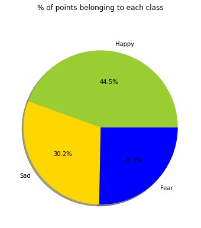
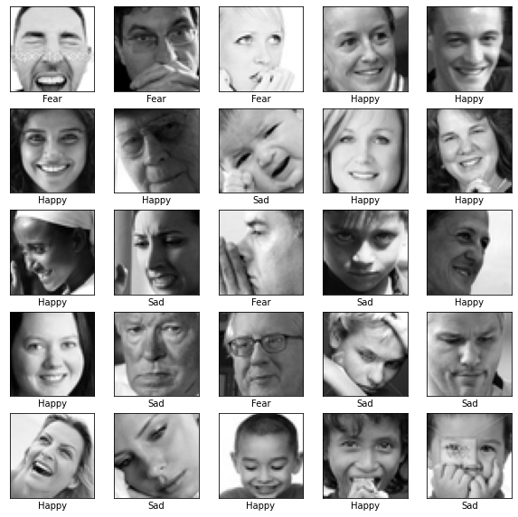
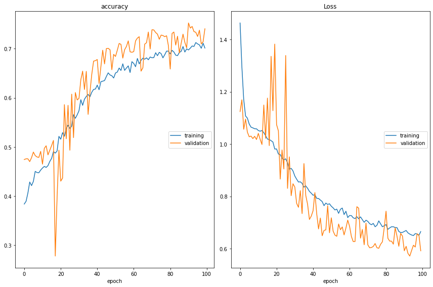

# Face Emotion Recognition AITHON2020

#### Team : The Elite

- Vidhya Subramaniam
- Devleena Banerjee
- Priyank jha
- Karthik chiranjeevi

#### Objective:
Building A Mood Classifier Based On Facial Expressions - With AI and Computer Vision

The objective of this study is to classify mood of the person from facial expressions Images are categorized in three classes namely sadness, fear and happiness based on the emotion shown in the facial expressions .

#### Dataset:
The data consists of 48x48 pixel grayscale images of faces. The pixel values are stored in 2304 (48*48) columns. These column names start with pixel. Along with pixel values, there is emotion column that say about mood of the image.

#### Sample images from dataset:

#### Model:
<pre>
_________________________________________________________________
Layer (type)                 Output Shape              Param #   
=================================================================
conv2d (Conv2D)              (None, 44, 44, 32)        832       
_________________________________________________________________
batch_normalization (BatchNo (None, 44, 44, 32)        128       
_________________________________________________________________
conv2d_1 (Conv2D)            (None, 40, 40, 32)        25632     
_________________________________________________________________
batch_normalization_1 (Batch (None, 40, 40, 32)        128       
_________________________________________________________________
max_pooling2d (MaxPooling2D) (None, 20, 20, 32)        0         
_________________________________________________________________
dropout (Dropout)            (None, 20, 20, 32)        0         
_________________________________________________________________
conv2d_2 (Conv2D)            (None, 18, 18, 64)        18496     
_________________________________________________________________
batch_normalization_2 (Batch (None, 18, 18, 64)        256       
_________________________________________________________________
conv2d_3 (Conv2D)            (None, 16, 16, 64)        36928     
_________________________________________________________________
batch_normalization_3 (Batch (None, 16, 16, 64)        256       
_________________________________________________________________
max_pooling2d_1 (MaxPooling2 (None, 7, 7, 64)          0         
_________________________________________________________________
dropout_1 (Dropout)          (None, 7, 7, 64)          0         
_________________________________________________________________
conv2d_4 (Conv2D)            (None, 5, 5, 128)         73856     
_________________________________________________________________
batch_normalization_4 (Batch (None, 5, 5, 128)         512       
_________________________________________________________________
conv2d_5 (Conv2D)            (None, 3, 3, 128)         147584    
_________________________________________________________________
batch_normalization_5 (Batch (None, 3, 3, 128)         512       
_________________________________________________________________
max_pooling2d_2 (MaxPooling2 (None, 2, 2, 128)         0         
_________________________________________________________________
dropout_2 (Dropout)          (None, 2, 2, 128)         0         
_________________________________________________________________
flatten (Flatten)            (None, 512)               0         
_________________________________________________________________
dense (Dense)                (None, 512)               262656    
_________________________________________________________________
dropout_3 (Dropout)          (None, 512)               0         
_________________________________________________________________
dense_1 (Dense)              (None, 3)                 1539      
=================================================================
Total params: 569,315
Trainable params: 568,419
Non-trainable params: 896</pre>

#### Results:
Training accuracy : 71%\
Testing accuracy  : 75%

